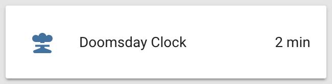
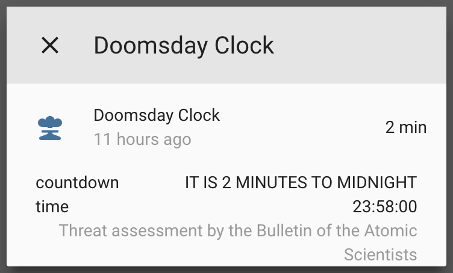

<h1 align="center">
  <a name="top">🕚</a><br/>Doomsday Clock sensor<br/> <sup><sub>🏡 a <a href="https://www.home-assistant.io/">Home Assistant</a> custom component …for your fallout shelter? 😱</sub></sup>
</h1>

[![GitHub Release][badge-release]][link-release]
[![Commits to be deployed][badge-unreleased]][link-unreleased]
[![Sensor][badge-hass]][link-hass]
[![Home Assistant Community Store][badge-hacs]][link-hacs]
[![Custom Updater][badge-custom-updater]][link-custom-updater]
[![Community Forum][badge-forum]][link-forum]
[![Maintainer][badge-maintainer]][link-maintainer]
[![All Contributors][badge-contributors]][link-contributors]
[![PRs Welcome][badge-contribute]][link-contribute]
[![License][badge-license]][link-license]
[![Tweet][badge-twitter]][link-twitter]

Add support for the [Doomsday Clock](https://en.wikipedia.org/wiki/Doomsday_Clock) world threat assessment index from the [Bulletin of the Atomic Scientists](https://thebulletin.org/doomsday-clock/) inside the [Home Assistant](https://home-assistant.io/) open-source home automation platform.

<div align="center">
    <p><strong>Be sure to <a href="#" title="star">⭐️</a> this repo if you find it useful! 😃</strong></p>
    <figure>
        <div>
            
            
        </div>
        <figcaption>
            <p><strong>Sensor state card and details popup.</strong></p>
        </figcaption>
    </figure>
</div>

<p align="right"><a href="#top" title="Back to top">🔝</a></p>


## Description 🕚

The [Doomsday Clock](https://thebulletin.org/doomsday-clock/current-time/)  helps monitor how close humanity is to a man-made global catastrophe, its own destruction if you will, either through nuclear war or climate change. Useful in case egocentric psychopaths keep on playing Russian roulette with humanity's future. Makes a great addition to your fallout shelter's Home Assistant build! 😱

<div align="center">
    <figure>
        <div>
            <a href="https://www.youtube.com/watch?v=jCnWPbn-ZKo"></a>
        </div>
        <figcaption>
            <p><strong><a href="https://www.youtube.com/watch?v=jCnWPbn-ZKo">Doomsday Clock description video by <em>Vox</em>.</a></strong></strong></p>
        </figcaption>
    </figure>
</div>

The clock doesn't change often, at most once a year, and offers no API. Since we rely on web scraping of [TheBulletin.org](https://thebulletin.org) the component has a goodwill throttle of 6 hours (21,600 seconds), but it would be best to set the scan interval for the sensor to 1 day (86,400 seconds) or more.

<p align="right"><a href="#top" title="Back to top">🔝</a></p>


## Usage 💻 [![Home Assistant Community Store][badge-hacs]][link-hacs] [![Custom Updater][badge-custom-updater]][link-custom-updater]

To enable the Doomsday Clock sensor in your installation:

1. Install the component using one of these methods:
    - **Using [HACS (Home Assistant Community Store)][link-hacs]:**  
    Add the following URL as a _custom integration repository_ through the Community Store interface.
        ```html
        https://github.com/renemarc/home-assistant-doomsday-clock
        ```
    - **Using [Custom Updater](https://github.com/custom-components/custom_updater) (now deprecated):**  
    Add the following to your `configuration.yaml` file.
        ```yaml
        custom_updater:
          component_urls:
            - https://raw.githubusercontent.com/renemarc/home-assistant-doomsday-clock/master/tracker.json
        ```
    - **Manually:**  
    Copy the folder [`/custom_components/doomsday_clock/`](./custom_components/doomsday_clock) to your configuration's [`/custom_components/`](https://developers.home-assistant.io/docs/en/creating_component_loading.html) directory (create it if needed).
2. Add the sensor to your `configuration.yaml` file ([see below ⬇️](#configuration-)).
3. Restart Home Assistant.
4. ~~Despair.~~ 😭
5. Tell your government representatives that you want to live in a healthy, peaceful world free from nuclear threats and fossil fuel pollution.  
    🕊🌱  
    It's easy and fast, just find and tweet them using these free online lists:
    - [🇺🇸 USA](http://www.tweetcongress.org/)
    - [🇨🇦 Canada](http://politwitter.ca/mp_search.php)
    - [🇪🇺 EU](https://twitter.com/europarl_en/lists/all-meps-on-twitter/members)
    - [🇬🇧 UK](https://www.mpsontwitter.co.uk/list)
    - [🇦🇺 Australia](https://twitter.com/mumbletwits/lists/federal-mps/members)
    - [🇳🇿 New Zealand](https://twitter.com/nzparliament/lists/mps)

<p align="right"><a href="#top" title="Back to top">🔝</a></p>


## Configuration ⚙

```yaml
# Example configuration.yaml entry
sensor:
  - platform: doomsday_clock
    scan_interval: 86400
```

- **icon** _(string) (optional)_  
  [Material Design Icon](https://materialdesignicons.com) that illustrates the sensor. (default = [`mdi:nuke`](https://materialdesignicons.com/icon/nuke))
- **name** _(string) (optional)_  
  Custom name of sensor. (default = `Doomsday Clock`)
- **scan_interval** _(number) (optional)_  
  Number of seconds between polls. (minimum = `21600` seconds [6 hours])
- **unit_of_measurement** _(string) (optional)_  
  Custom unit of measurement for the value. (default = `min`)
- **value_template** _([template](https://home-assistant.io/docs/configuration/templating/)) (optional)_  
  Custom template to manipulate the state of the sensor.

<p align="right"><a href="#top" title="Back to top">🔝</a></p>


## Contributors ✨ [![All Contributors][badge-contributors]][link-contribute] [![Community Forum][badge-forum]][link-forum]

<!-- ALL-CONTRIBUTORS-LIST:START - Do not remove or modify this section -->
<!-- prettier-ignore -->
<table><tr><td align="center"><a href="https://renemarc.com/"><br /><sub><b>René-Marc Simard</b></sub></a><br /><a href="https://github.com/renemarc/home-assistant-doomsday-clock/commits?author=renemarc" title="Code">💻</a> <a href="https://github.com/renemarc/home-assistant-doomsday-clock/commits?author=renemarc" title="Documentation">📖</a></td><td align="center"><a href="https://github.com/jamiepryer"><br /><sub><b>jamiepryer</b></sub></a><br /><a href="https://github.com/renemarc/home-assistant-doomsday-clock/issues?q=author%3Ajamiepryer" title="Bug reports">🐛</a></td><td align="center"><a href="http://johntdyer.com"><br /><sub><b>John Dyer</b></sub></a><br /><a href="#ideas-johntdyer" title="Ideas, Planning, & Feedback">🤔</a></td></tr></table>

<!-- ALL-CONTRIBUTORS-LIST:END -->

This project follows the [all-contributors](https://allcontributors.org) specification ([emoji key available here](https://allcontributors.org/docs/en/emoji-key)). Found a bug, want to suggest an idea or share some improvements? [Contributions of any kind are welcome!](./CONTRIBUTING.md) 😃

<p align="right"><a href="#top" title="Back to top">🔝</a></p>


## Thanks 💕

- [@custom_components](https://github.com/custom-components) for their [component blueprint](https://github.com/custom-components/blueprint) and Home Assistant integration tools.
- [@mattbierner](https://github.com/mattbierner) for the inspiration from his [MinutesToMidnight](https://github.com/mattbierner/MinutesToMidnight) Node.js library.
- The [Bulletin of the Atomic Scientists](https://thebulletin.org/doomsday-clock/past-announcements/) for keeping the world in check since 1947.

<div align="center">
    <figure>
        <div>
            <a href="https://www.youtube.com/watch?v=JxN70DYuPuA"></a>
        </div>
        <figcaption>
            <p><strong><a href="https://www.youtube.com/watch?v=JxN70DYuPuA" title="Bethesda's Fallout Vault Boy in &quot;Atomics for Peace&quot;">🕊️ Make the world a better place! 🌱</a></strong></p>
        </figcaption>
    </figure>
</div>


<!--
Footer starts.
-->
<p align="right"><a href="#top" title="Back to top">🔝</a></p>

<p align="right"><strong>Don't forget to <a href="#" title="star">⭐️</a> this repo! 😃</strong></p>
<!--
Footer ends.
-->


<!--
Image references.
-->

[badge-contribute]:https://img.shields.io/badge/pull_requests-welcome-brightgreen.svg?logo=data:image/svg+xml;base64,PD94bWwgdmVyc2lvbj0iMS4wIiBlbmNvZGluZz0iVVRGLTgiPz48IURPQ1RZUEUgc3ZnIFBVQkxJQyAiLS8vVzNDLy9EVEQgU1ZHIDEuMS8vRU4iICJodHRwOi8vd3d3LnczLm9yZy9HcmFwaGljcy9TVkcvMS4xL0RURC9zdmcxMS5kdGQiPjxzdmcgeG1sbnM9Imh0dHA6Ly93d3cudzMub3JnLzIwMDAvc3ZnIiB4bWxuczp4bGluaz0iaHR0cDovL3d3dy53My5vcmcvMTk5OS94bGluayIgdmVyc2lvbj0iMS4xIiB3aWR0aD0iMjQiIGhlaWdodD0iMjQiIHZpZXdCb3g9IjAgMCAyNCAyNCI+PHBhdGggZD0iTTYsM0EzLDMgMCAwLDEgOSw2QzksNy4zMSA4LjE3LDguNDIgNyw4LjgzVjE1LjE3QzguMTcsMTUuNTggOSwxNi42OSA5LDE4QTMsMyAwIDAsMSA2LDIxQTMsMyAwIDAsMSAzLDE4QzMsMTYuNjkgMy44MywxNS41OCA1LDE1LjE3VjguODNDMy44Myw4LjQyIDMsNy4zMSAzLDZBMywzIDAgMCwxIDYsM002LDVBMSwxIDAgMCwwIDUsNkExLDEgMCAwLDAgNiw3QTEsMSAwIDAsMCA3LDZBMSwxIDAgMCwwIDYsNU02LDE3QTEsMSAwIDAsMCA1LDE4QTEsMSAwIDAsMCA2LDE5QTEsMSAwIDAsMCA3LDE4QTEsMSAwIDAsMCA2LDE3TTIxLDE4QTMsMyAwIDAsMSAxOCwyMUEzLDMgMCAwLDEgMTUsMThDMTUsMTYuNjkgMTUuODMsMTUuNTggMTcsMTUuMTdWN0gxNVYxMC4yNUwxMC43NSw2TDE1LDEuNzVWNUgxN0EyLDIgMCAwLDEgMTksN1YxNS4xN0MyMC4xNywxNS41OCAyMSwxNi42OSAyMSwxOE0xOCwxN0ExLDEgMCAwLDAgMTcsMThBMSwxIDAgMCwwIDE4LDE5QTEsMSAwIDAsMCAxOSwxOEExLDEgMCAwLDAgMTgsMTdaIiBmaWxsPSIjZmZmZmZmIiAvPjwvc3ZnPgo=&maxAge=86400

[badge-contributors]:https://img.shields.io/badge/all_contributors-3-orange.svg?logo=github&maxAge=21600

[badge-custom-updater]:https://img.shields.io/badge/custom__updater-true-success.svg?logo=data:image/svg+xml;base64,PD94bWwgdmVyc2lvbj0iMS4wIiBlbmNvZGluZz0iVVRGLTgiPz4KPCFET0NUWVBFIHN2ZyBQVUJMSUMgIi0vL1czQy8vRFREIFNWRyAxLjEvL0VOIiAiaHR0cDovL3d3dy53My5vcmcvR3JhcGhpY3MvU1ZHLzEuMS9EVEQvc3ZnMTEuZHRkIj4KPHN2ZyB4bWxucz0iaHR0cDovL3d3dy53My5vcmcvMjAwMC9zdmciIHhtbG5zOnhsaW5rPSJodHRwOi8vd3d3LnczLm9yZy8xOTk5L3hsaW5rIiB2ZXJzaW9uPSIxLjEiICB3aWR0aD0iMjQiIGhlaWdodD0iMjQiIHZpZXdCb3g9IjAgMCAyNCAyNCI+CiAgIDxwYXRoIGZpbGw9IiNmZmZmZmYiIGQ9Ik0yMSwxMC4xMkgxNC4yMkwxNi45Niw3LjNDMTQuMjMsNC42IDkuODEsNC41IDcuMDgsNy4yQzQuMzUsOS45MSA0LjM1LDE0LjI4IDcuMDgsMTdDOS44MSwxOS43IDE0LjIzLDE5LjcgMTYuOTYsMTdDMTguMzIsMTUuNjUgMTksMTQuMDggMTksMTIuMUgyMUMyMSwxNC4wOCAyMC4xMiwxNi42NSAxOC4zNiwxOC4zOUMxNC44NSwyMS44NyA5LjE1LDIxLjg3IDUuNjQsMTguMzlDMi4xNCwxNC45MiAyLjExLDkuMjggNS42Miw1LjgxQzkuMTMsMi4zNCAxNC43NiwyLjM0IDE4LjI3LDUuODFMMjEsM1YxMC4xMk0xMi41LDhWMTIuMjVMMTYsMTQuMzNMMTUuMjgsMTUuNTRMMTEsMTNWOEgxMi41WiIgLz4KPC9zdmc+&maxAge=86400

[badge-forum]:https://img.shields.io/badge/community-forum-brightgreen.svg?logo=data:image/svg+xml;base64,PD94bWwgdmVyc2lvbj0iMS4wIiBlbmNvZGluZz0iVVRGLTgiPz4KPCFET0NUWVBFIHN2ZyBQVUJMSUMgIi0vL1czQy8vRFREIFNWRyAxLjEvL0VOIiAiaHR0cDovL3d3dy53My5vcmcvR3JhcGhpY3MvU1ZHLzEuMS9EVEQvc3ZnMTEuZHRkIj4KPHN2ZyB4bWxucz0iaHR0cDovL3d3dy53My5vcmcvMjAwMC9zdmciIHhtbG5zOnhsaW5rPSJodHRwOi8vd3d3LnczLm9yZy8xOTk5L3hsaW5rIiB2ZXJzaW9uPSIxLjEiICB3aWR0aD0iMjQiIGhlaWdodD0iMjQiIHZpZXdCb3g9IjAgMCAyNCAyNCI+CiAgIDxwYXRoIGZpbGw9IiNmZmZmZmYiIGQ9Ik0xNywxMlYzQTEsMSAwIDAsMCAxNiwySDNBMSwxIDAgMCwwIDIsM1YxN0w2LDEzSDE2QTEsMSAwIDAsMCAxNywxMk0yMSw2SDE5VjE1SDZWMTdBMSwxIDAgMCwwIDcsMThIMThMMjIsMjJWN0ExLDEgMCAwLDAgMjEsNloiIC8+Cjwvc3ZnPg==&maxAge=86400

[badge-hacs]:https://img.shields.io/badge/community_store-true-success.svg?logo=data:image/svg+xml;base64,PD94bWwgdmVyc2lvbj0iMS4wIiBlbmNvZGluZz0iVVRGLTgiPz4KPCFET0NUWVBFIHN2ZyBQVUJMSUMgIi0vL1czQy8vRFREIFNWRyAxLjEvL0VOIiAiaHR0cDovL3d3dy53My5vcmcvR3JhcGhpY3MvU1ZHLzEuMS9EVEQvc3ZnMTEuZHRkIj4KPHN2ZyB4bWxucz0iaHR0cDovL3d3dy53My5vcmcvMjAwMC9zdmciIHhtbG5zOnhsaW5rPSJodHRwOi8vd3d3LnczLm9yZy8xOTk5L3hsaW5rIiB2ZXJzaW9uPSIxLjEiICB3aWR0aD0iMjQiIGhlaWdodD0iMjQiIHZpZXdCb3g9IjAgMCAyNCAyNCI+CiAgIDxwYXRoIGZpbGw9IiNmZmZmZmYiIGQ9Ik0xNywxOEMxNS44OSwxOCAxNSwxOC44OSAxNSwyMEEyLDIgMCAwLDAgMTcsMjJBMiwyIDAgMCwwIDE5LDIwQzE5LDE4Ljg5IDE4LjEsMTggMTcsMThNMSwyVjRIM0w2LjYsMTEuNTlMNS4yNCwxNC4wNEM1LjA5LDE0LjMyIDUsMTQuNjUgNSwxNUEyLDIgMCAwLDAgNywxN0gxOVYxNUg3LjQyQTAuMjUsMC4yNSAwIDAsMSA3LjE3LDE0Ljc1QzcuMTcsMTQuNyA3LjE4LDE0LjY2IDcuMiwxNC42M0w4LjEsMTNIMTUuNTVDMTYuMywxMyAxNi45NiwxMi41OCAxNy4zLDExLjk3TDIwLjg4LDUuNUMyMC45NSw1LjM0IDIxLDUuMTcgMjEsNUExLDEgMCAwLDAgMjAsNEg1LjIxTDQuMjcsMk03LDE4QzUuODksMTggNSwxOC44OSA1LDIwQTIsMiAwIDAsMCA3LDIyQTIsMiAwIDAsMCA5LDIwQzksMTguODkgOC4xLDE4IDcsMThaIiAvPgo8L3N2Zz4=&maxAge=86400

[badge-hass]:https://img.shields.io/badge/Home_Assistant-0.88+-53c1f1.svg?logo=data:image/svg+xml;base64,PD94bWwgdmVyc2lvbj0iMS4wIiBlbmNvZGluZz0iVVRGLTgiPz48IURPQ1RZUEUgc3ZnIFBVQkxJQyAiLS8vVzNDLy9EVEQgU1ZHIDEuMS8vRU4iICJodHRwOi8vd3d3LnczLm9yZy9HcmFwaGljcy9TVkcvMS4xL0RURC9zdmcxMS5kdGQiPjxzdmcgeG1sbnM9Imh0dHA6Ly93d3cudzMub3JnLzIwMDAvc3ZnIiB4bWxuczp4bGluaz0iaHR0cDovL3d3dy53My5vcmcvMTk5OS94bGluayIgdmVyc2lvbj0iMS4xIiB3aWR0aD0iMjQiIGhlaWdodD0iMjQiIHZpZXdCb3g9IjAgMCAyNCAyNCI+PHBhdGggZD0iTTIxLjgsMTNIMjBWMjFIMTNWMTcuNjdMMTUuNzksMTQuODhMMTYuNSwxNUMxNy42NiwxNSAxOC42LDE0LjA2IDE4LjYsMTIuOUMxOC42LDExLjc0IDE3LjY2LDEwLjggMTYuNSwxMC44QTIuMSwyLjEgMCAwLDAgMTQuNCwxMi45TDE0LjUsMTMuNjFMMTMsMTUuMTNWOS42NUMxMy42Niw5LjI5IDE0LjEsOC42IDE0LjEsNy44QTIuMSwyLjEgMCAwLDAgMTIsNS43QTIuMSwyLjEgMCAwLDAgOS45LDcuOEM5LjksOC42IDEwLjM0LDkuMjkgMTEsOS42NVYxNS4xM0w5LjUsMTMuNjFMOS42LDEyLjlBMi4xLDIuMSAwIDAsMCA3LjUsMTAuOEEyLjEsMi4xIDAgMCwwIDUuNCwxMi45QTIuMSwyLjEgMCAwLDAgNy41LDE1TDguMjEsMTQuODhMMTEsMTcuNjdWMjFINFYxM0gyLjI1QzEuODMsMTMgMS40MiwxMyAxLjQyLDEyLjc5QzEuNDMsMTIuNTcgMS44NSwxMi4xNSAyLjI4LDExLjcyTDExLDNDMTEuMzMsMi42NyAxMS42NywyLjMzIDEyLDIuMzNDMTIuMzMsMi4zMyAxMi42NywyLjY3IDEzLDNMMTcsN1Y2SDE5VjlMMjEuNzgsMTEuNzhDMjIuMTgsMTIuMTggMjIuNTksMTIuNTkgMjIuNiwxMi44QzIyLjYsMTMgMjIuMiwxMyAyMS44LDEzTTcuNSwxMkEwLjksMC45IDAgMCwxIDguNCwxMi45QTAuOSwwLjkgMCAwLDEgNy41LDEzLjhBMC45LDAuOSAwIDAsMSA2LjYsMTIuOUEwLjksMC45IDAgMCwxIDcuNSwxMk0xNi41LDEyQzE3LDEyIDE3LjQsMTIuNCAxNy40LDEyLjlDMTcuNCwxMy40IDE3LDEzLjggMTYuNSwxMy44QTAuOSwwLjkgMCAwLDEgMTUuNiwxMi45QTAuOSwwLjkgMCAwLDEgMTYuNSwxMk0xMiw2LjlDMTIuNSw2LjkgMTIuOSw3LjMgMTIuOSw3LjhDMTIuOSw4LjMgMTIuNSw4LjcgMTIsOC43QzExLjUsOC43IDExLjEsOC4zIDExLjEsNy44QzExLjEsNy4zIDExLjUsNi45IDEyLDYuOVoiIGZpbGw9IiNmZmZmZmYiIC8+PC9zdmc+Cg==&maxAge=86400

[badge-license]:https://img.shields.io/github/license/renemarc/home-assistant-doomsday-clock.svg?logo=data:image/svg+xml;base64,PD94bWwgdmVyc2lvbj0iMS4wIiBlbmNvZGluZz0iVVRGLTgiPz4KPCFET0NUWVBFIHN2ZyBQVUJMSUMgIi0vL1czQy8vRFREIFNWRyAxLjEvL0VOIiAiaHR0cDovL3d3dy53My5vcmcvR3JhcGhpY3MvU1ZHLzEuMS9EVEQvc3ZnMTEuZHRkIj4KPHN2ZyB4bWxucz0iaHR0cDovL3d3dy53My5vcmcvMjAwMC9zdmciIHhtbG5zOnhsaW5rPSJodHRwOi8vd3d3LnczLm9yZy8xOTk5L3hsaW5rIiB2ZXJzaW9uPSIxLjEiICB3aWR0aD0iMjQiIGhlaWdodD0iMjQiIHZpZXdCb3g9IjAgMCAyNCAyNCI+CiAgIDxwYXRoIGZpbGw9IiNmZmZmZmYiIGQ9Ik0xMiwzQzEwLjczLDMgOS42LDMuOCA5LjE4LDVIM1Y3SDQuOTVMMiwxNEMxLjUzLDE2IDMsMTcgNS41LDE3QzgsMTcgOS41NiwxNiA5LDE0TDYuMDUsN0g5LjE3QzkuNSw3Ljg1IDEwLjE1LDguNSAxMSw4LjgzVjIwSDJWMjJIMjJWMjBIMTNWOC44MkMxMy44NSw4LjUgMTQuNSw3Ljg1IDE0LjgyLDdIMTcuOTVMMTUsMTRDMTQuNTMsMTYgMTYsMTcgMTguNSwxN0MyMSwxNyAyMi41NiwxNiAyMiwxNEwxOS4wNSw3SDIxVjVIMTQuODNDMTQuNCwzLjggMTMuMjcsMyAxMiwzTTEyLDVBMSwxIDAgMCwxIDEzLDZBMSwxIDAgMCwxIDEyLDdBMSwxIDAgMCwxIDExLDZBMSwxIDAgMCwxIDEyLDVNNS41LDEwLjI1TDcsMTRINEw1LjUsMTAuMjVNMTguNSwxMC4yNUwyMCwxNEgxN0wxOC41LDEwLjI1WiIgLz4KPC9zdmc+&maxAge=86400

[badge-maintainer]:https://img.shields.io/badge/maintainer-René--Marc%20Simard-blue.svg?logo=data:image/svg+xml;base64,PD94bWwgdmVyc2lvbj0iMS4wIiBlbmNvZGluZz0iVVRGLTgiPz4KPCFET0NUWVBFIHN2ZyBQVUJMSUMgIi0vL1czQy8vRFREIFNWRyAxLjEvL0VOIiAiaHR0cDovL3d3dy53My5vcmcvR3JhcGhpY3MvU1ZHLzEuMS9EVEQvc3ZnMTEuZHRkIj4KPHN2ZyB4bWxucz0iaHR0cDovL3d3dy53My5vcmcvMjAwMC9zdmciIHhtbG5zOnhsaW5rPSJodHRwOi8vd3d3LnczLm9yZy8xOTk5L3hsaW5rIiB2ZXJzaW9uPSIxLjEiICB3aWR0aD0iMjQiIGhlaWdodD0iMjQiIHZpZXdCb3g9IjAgMCAyNCAyNCI+CiAgIDxwYXRoIGZpbGw9IiNmZmZmZmYiIGQ9Ik0xMiwyQTEwLDEwIDAgMCwwIDIsMTJBMTAsMTAgMCAwLDAgMTIsMjJBMTAsMTAgMCAwLDAgMjIsMTJBMTAsMTAgMCAwLDAgMTIsMk0xMSwxNC40MVYxOS45M0M5LjU4LDE5Ljc1IDguMjMsMTkuMTkgNy4xLDE4LjMxTDExLDE0LjQxTTEzLDE0LjQxTDE2LjksMTguMzFDMTUuNzcsMTkuMTkgMTQuNDIsMTkuNzUgMTMsMTkuOTNWMTQuNDFNNCwxMkM0LDcuOTcgNyw0LjU3IDExLDQuMDdWMTEuNTlMNS42OSwxNi45QzQuNTksMTUuNSA0LDEzLjc4IDQsMTJNMTguMzEsMTYuOUwxMywxMS41OVY0LjA3QzE3LDQuNTcgMjAsNy45NyAyMCwxMkMyMCwxMy43OCAxOS40MSwxNS41IDE4LjMxLDE2LjlaIiAvPgo8L3N2Zz4=&maxAge=86400

[badge-release]:https://img.shields.io/github/release/renemarc/home-assistant-doomsday-clock/all.svg?logo=git&logoColor=white&maxAge=21600

[badge-twitter]:https://img.shields.io/twitter/url/https/github.com/renemarc/home-assistant-doomsday-clock.svg?style=social&cacheSeconds=86400

[badge-unreleased]:https://img.shields.io/github/commits-since/renemarc/home-assistant-doomsday-clock/latest.svg?label=commits%20to%20be%20deployed&logo=data:image/svg+xml;base64,PD94bWwgdmVyc2lvbj0iMS4wIiBlbmNvZGluZz0iVVRGLTgiPz4KPCFET0NUWVBFIHN2ZyBQVUJMSUMgIi0vL1czQy8vRFREIFNWRyAxLjEvL0VOIiAiaHR0cDovL3d3dy53My5vcmcvR3JhcGhpY3MvU1ZHLzEuMS9EVEQvc3ZnMTEuZHRkIj4KPHN2ZyB4bWxucz0iaHR0cDovL3d3dy53My5vcmcvMjAwMC9zdmciIHhtbG5zOnhsaW5rPSJodHRwOi8vd3d3LnczLm9yZy8xOTk5L3hsaW5rIiB2ZXJzaW9uPSIxLjEiIHdpZHRoPSIyNCIgaGVpZ2h0PSIyNCIgdmlld0JveD0iMCAwIDI0IDI0Ij4KCTxwYXRoIGZpbGw9IiNmZmZmZmYiIGQ9Ik0xMy41LDhIMTJWMTNMMTYuMjgsMTUuNTRMMTcsMTQuMzNMMTMuNSwxMi4yNVY4TTEzLDNBOSw5IDAgMCwwIDQsMTJIMUw0Ljk2LDE2LjAzTDksMTJINkE3LDcgMCAwLDEgMTMsNUE3LDcgMCAwLDEgMjAsMTJBNyw3IDAgMCwxIDEzLDE5QzExLjA3LDE5IDkuMzIsMTguMjEgOC4wNiwxNi45NEw2LjY0LDE4LjM2QzguMjcsMjAgMTAuNSwyMSAxMywyMUE5LDkgMCAwLDAgMjIsMTJBOSw5IDAgMCwwIDEzLDMiIC8+Cjwvc3ZnPgo=&cacheSeconds=300

<!--
Link references.
-->

[link-contribute]:CONTRIBUTING.md
[link-contributors]:#contributors---
[link-custom-updater]:https://github.com/custom-components/custom_updater
[link-forum]:https://community.home-assistant.io/t/doomsday-clock-custom-sensor/40758
[link-hacs]:https://hacs.xyz/
[link-hass]:https://home-assistant.io/
[link-license]:LICENSE
[link-maintainer]:https://github.com/renemarc/
[link-release]:https://github.com/renemarc/home-assistant-doomsday-clock/releases/latest
[link-twitter]:https://twitter.com/intent/tweet?text=Display%20the%20%23DoomsdayClock%20inside%20your%20%23HomeAssistant%20%E2%80%A6%23FalloutShelter%21%3F&url=https%3A%2F%2Fgithub.com%2Frenemarc%2Fhome-assistant-doomsday-clock&via=renemarc
[link-unreleased]:https://github.com/renemarc/home-assistant-doomsday-clock/compare/2.1.0...master
