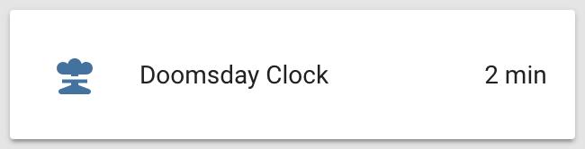

# Home Assistant Doomsday Clock sensor &nbsp; [](https://twitter.com/intent/tweet?text=Display%20the%20Doomsday%20Clock%20inside%20your%20fallout%20shelter%27s%20Home%20Assistant!&url=https://github.com/renemarc/home-assistant-doomsday-clock&via=renemarc&hashtags=HomeAssistant,Python,Doomsday,Doomsday_Clock,Peace)

[![Price][img-price]][link-license]
[![Sensor][img-hass]][link-hass]
[![License][img-license]][link-license]
[![GitHub Release][img-github-release]][link-repo]

Add support for the [Doomsday Clock](https://en.wikipedia.org/wiki/Doomsday_Clock) world threat assessment index from the [Bulletin of the Atomic Scientists](https://thebulletin.org/doomsday-clock/) inside the [Home Assistant](https://home-assistant.io/) open-source home automation platform.

<div align="center">
    <p><strong>Be sure to <a href="#" title="star">⭐️</a> this repo if you find it useful! 😃</strong></p>
    <figure>
        <div>
            
            
        </div>
        <figcaption>
            <p><strong>Sensor state card and details popup.</strong></p>
        </figcaption>
    </figure>
</div>

<p align="right"><a href="#" title="Back to top">⬆️</a></p>


## Description

The Doomsday Clock helps monitor how close humanity is to a man-made global catastrophe, its own destruction if you will, either through nuclear war or climate change. Useful in case egocentric psychopaths keep on playing Russian roulette with humanity's future. Makes a great addition to your fallout shelter's Home Assistant build!

<div align="center">
    <figure>
        <div>
            <a href="https://www.youtube.com/watch?v=jCnWPbn-ZKo"></a>
        </div>
        <figcaption>
            <p><strong><a href="https://www.youtube.com/watch?v=jCnWPbn-ZKo">Doomsday Clock description video by Vox.</a></strong></strong></p>
        </figcaption>
    </figure>
</div>

The clock doesn't change often, at most once a year, and offers no API. Since we rely on web scraping of their web site the component has a goodwill throttle of 6 hours (21600 seconds), but it would be best to set the scan interval for the sensor to 1 day (86400 seconds) or more.

<p align="right"><a href="#" title="Back to top">⬆️</a></p>


## Usage

To enable the Doomsday Clock sensor in your installation:

1. Copy the file [`doomsday_clock.py`](doomsday_clock.py) to your configuration's `/custom_components/sensor/` directory (create it if necessary). 
2. Add the sensor to your `configuration.yaml` file ([see below](#configuration)).
3. Restart Home Assistant.
4. ~~Despair.~~ 😭
5. Tell your government representatives that you want to live in a healthy, peaceful world free from nuclear threats and fossil fuel pollution.  
    🕊🌱  
    It's easy and fast, just find and tweet them using these free online lists:
    - [🇺🇸 USA](http://www.tweetcongress.org/)
    - [🇨🇦 Canada](http://politwitter.ca/mp_search.php)
    - [🇪🇺 EU](https://twitter.com/europarl_en/lists/all-meps-on-twitter/members)
    - [🇬🇧 UK](https://www.mpsontwitter.co.uk/list)
    - [🇦🇺 Australia](https://twitter.com/mumbletwits/lists/federal-mps/members)
    - [🇳🇿 New Zealand](https://twitter.com/nzparliament/lists/mps)

<p align="right"><a href="#" title="Back to top">⬆️</a></p>


## Configuration

```yaml
# Example configuration.yaml entry
sensor:
  - platform: doomsday_clock
    scan_interval: 86400
```

- **icon** _(string) (optional)_ Specify a [Material Design Icon](https://materialdesignicons.com) to illustrate the sensor. (default = `mdi:nuke`)
- **name** _(string) (optional)_ Name of sensor. (default = `Doomsday Clock`)
- **scan_interval** _(number) (optional)_ Number of seconds between polls. (minimum = `21600` seconds [6 hours])
- **unit_of_measurement** _(string) (optional)_ Defines the units of measurement of the sensor. (default = `min`)
- **value_template** _([template](https://home-assistant.io/docs/configuration/templating/)) (optional)_ Defines a template to manipulate the state of the sensor.

<p align="right"><a href="#" title="Back to top">⬆️</a></p>


## Thanks

- [@mattbierner](https://github.com/mattbierner) for the inspiration from his [MinutesToMidnight](https://github.com/mattbierner/MinutesToMidnight) Node.js library.
- The [Bulletin of the Atomic Scientists](https://thebulletin.org/doomsday-clock/past-announcements/) for keeping the world in check since 1947.

<div align="center">
    <figure>
        <div>
            
        </div>
        <figcaption>
            <p><strong>🕊️ Make the world a better place! 🌱</strong></p>
        </figcaption>
    </figure>
</div>


<!--
Footer starts.
-->
<p align="right"><a href="#" title="Back to top">⬆️</a></p>

<p align="right"><strong>Don't forget to <a href="#" title="star">⭐️</a> this repo! 😃</strong></p>
<!--
Footer ends.
-->


<!--
Image references.
-->

[img-hass]:https://img.shields.io/badge/sensor_for-Home_Assistant-53c1f1.svg
[img-github-release]:https://img.shields.io/github/release/renemarc/home-assistant-doomsday-clock/all.svg
[img-license]:https://img.shields.io/github/license/renemarc/home-assistant-doomsday-clock.svg
[img-price]:https://img.shields.io/badge/price-FREE-53c1f1.svg

<!--
Link references.
-->

[link-hass]:https://home-assistant.io/
[link-license]:LICENSE.txt
[link-repo]:https://github.com/renemarc/home-assistant-doomsday-clock
